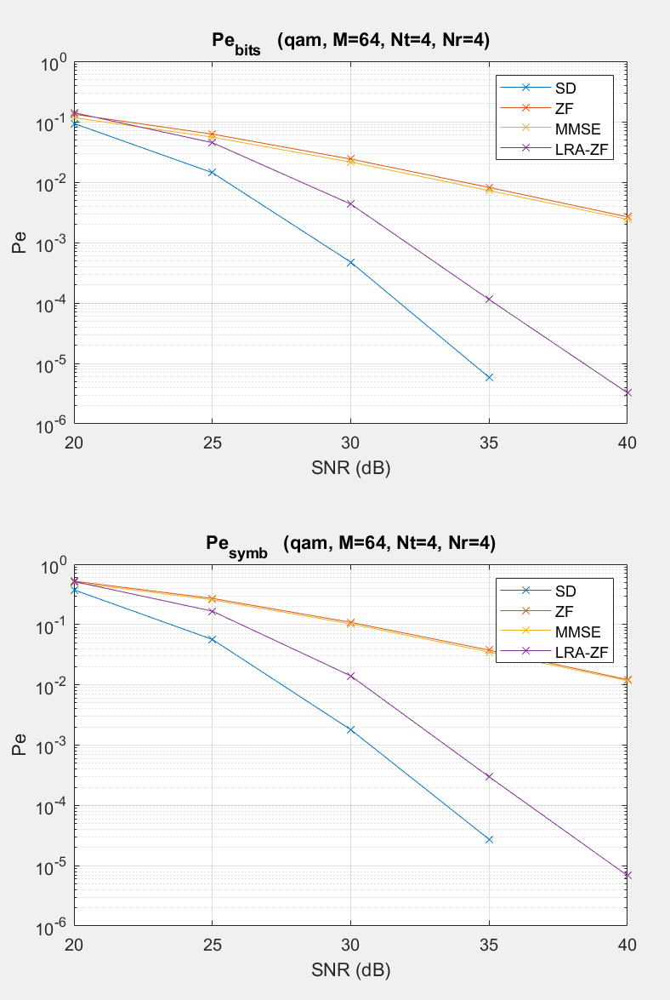

# MIMO Detection Techniques in MATLAB

This project implements various **MIMO (Multiple-Input, Multiple-Output) detection techniques** for wireless communication systems using MATLAB. The methods included are:

- **Zero Forcing (ZF)**
- **MMSE (Minimum Mean Squared Error)**
- **Lattice Reduction Aided (LRA) with CLLL algorithm**
- **Sphere Decoding (SD)**
- **OGD (Online Gradient Descent)**

The implementation allows simulation of these detection techniques in different MIMO settings, focusing on bit error rate (BER) performance evaluation over different SNR (Signal-to-Noise Ratio) values.


## Table of Contents

1. [Project Structure](#project-structure)
2. [Methods Implemented](#methods-implemented)
   - [Zero Forcing (ZF)](#1-zero-forcing-zf)
   - [MMSE (Minimum Mean Squared Error)](#2-mmse-minimum-mean-squared-error)
   - [Lattice Reduction Aided Detection (LRA)](#3-lattice-reduction-aided-detection-lra)
   - [Sphere Decoding (SD)](#4-sphere-decoding-sd)
   - [OGD (Online Gradient Descent)](#5-ogd-online-gradient-descent)
3. [Helper Functions](#helper-functions)
   - [detection.m](#1-detectionm)
   - [constellation.m](#2-constellationm)
   - [grayMatrixGenerator.m](#3-graymatrixgeneratorm)
   - [symbolIndexGenerator.m](#4-symbolindexgeneratorm)
   - [sizeReduce.m](#5-sizereducem)
   - [wrapper.m / unwrapper.m](#6-wrapperm--unwrapperm)
4. [Output Example](#output-example)
5. [How to Run](#how-to-run)
6. [Refrences](#refrences)

## Project Structure

### Main File: `main.m`
The main script runs the simulation, initializes key parameters, and selects the detection method to evaluate. The core sections of the `main.m` file are:

1. **Initialization**: 
   - Sets the modulation scheme, number of bits, antennas, and SNR values.
   - Example parameters:
     - Modulation: QAM, PSK, or PAM.
     - Number of transmit and receive antennas.
     - Number of bits and bits per symbol.
     - SNR range for simulation.

2. **Simulation Loop**:
   - Iterates over the specified detection methods (e.g., ZF, OGD) and SNR values.
   - Generates random bit sequences, maps them to modulation symbols, and applies the detection method for each transmission.
   - Calculates the **Bit Error Rate (BER)** and **Symbol Error Rate (SER)**.
   - The simulation results are plotted to compare performance across methods.


## Methods Implemented

### 1. [Zero Forcing (ZF)](#1-zero-forcing-zf)
   - **Code Location**: `ZF.m`
   - **Description**: The ZF method inverts the channel matrix to nullify the interference between transmitted signals. However, it is sensitive to noise, especially when the channel matrix is ill-conditioned.
   - **Application**: Simple and fast but can perform poorly at low SNR values.

### 2. [MMSE (Minimum Mean Squared Error)](#2-mmse-minimum-mean-squared-error)
   - **Code Location**: `MMSE.m`
   - **Description**: MMSE improves upon ZF by considering the noise in the system. It strikes a balance between interference cancellation and noise enhancement.
   - **Application**: Offers better performance than ZF, especially in noisy conditions.

### 3. [Lattice Reduction Aided Detection (LRA)](#3-lattice-reduction-aided-detection-lra)
   - **Code Location**: `LRA.m`, with helper functions like `sizeReduce.m`, `wrapper.m`, and `unwrapper.m`.
   - **Description**: This technique uses the CLLL (Complex LLL) algorithm to reduce the channel matrix to a more favorable lattice structure, improving detection performance.
   - **Application**: LRA-ZF and LRA-MMSE provide better error rates by enhancing the structure of the channel before applying ZF or MMSE.

### 4. [Sphere Decoding (SD)](#4-sphere-decoding-sd)
   - **Code Location**: `SD.m`
   - **Description**: SD performs an exhaustive search within a limited sphere around the received signal to find the transmitted symbol. It is computationally expensive but provides near-optimal performance.
   - **Application**: Used for high-performance MIMO detection, especially at moderate to high SNRs.

### 5. [OGD (Online Gradient Descent)](#5-ogd-online-gradient-descent)
   - **Code Location**: `OGD.m`
   - **Description**: A new, incomplete method based on **online gradient descent** and distributed computing. This method is still under development and aims to optimize MIMO detection using iterative optimization techniques.
   - **Application**: Useful in distributed systems where computational resources are limited.


## Helper Functions

### 1. [detector.m](#1-detectionm)
   - This function selects and applies the appropriate detection method based on the user’s input. It uses a `switch` block to call different detection algorithms like ZF, MMSE, LRA, and SD.

### 2. [constellation.m](#2-constellationm)
   - Generates the modulation constellation (QAM, PAM, PSK/QPSK) used for mapping the bit sequence to symbols. The function returns the constellation points and their energy.

### 3. [grayMatrixGenerator.m](#3-graymatrixgeneratorm)
   - Creates a matrix that represents the Gray-coded binary values. This is used for mapping bits to symbols in a Gray-coded fashion.

### 4. [symbolIndexGenerator.m](#4-symbolindexgeneratorm)
   - Maps the transmitted bits to symbol indices based on the modulation scheme (e.g., QAM or PSK).

### 5. [sizeReduce.m](#5-sizereducem)
   - A helper function used within the LRA method for reducing the dimensionality of the problem during lattice reduction.

### 6. [wrapper.m / unwrapper.m](#6-wrapperm--unwrapperm)
   - These functions are used in the LRA method. `wrapper.m` scales and shifts the problem to work with integer solutions, while `unwrapper.m` decodes the results back to constellation values.

## Output Example
A simulation output is showed below with the refrence graph for comparison. Outputs are figures with two subplots for showing SER and BER for each detection method:

<div style="display: flex; justify-content: space-between;">
  
  
</div>


## How to Run

1. Clone the repository and navigate to the project folder:
   ```bash
   git clone https://github.com/yourusername/mimo-detection.git
   cd mimo-detection
   ```

2. Open MATLAB and run the `main.m` file:
   ```matlab
   main
   ```

3. Modify the parameters in the **Initialization** block to customize the simulation (e.g., change modulation scheme, antenna count, or detection method).

4. View the resulting BER and SER plots for each detection method to compare performance.

## References

This project is based on several books and research papers:

- General Knowledge About MIMO
   - [MIMO Processing for 4G and Beyond](https://www.routledge.com/MIMO-Processing-for-4G-and-Beyond-Fundamentals-and-Evolution/daSilva-Monteiro/p/book/9781138033979?srsltid=AfmBOorIMY50--PZ4d7Fj0wxVLR855Y4Azan6QII4Q0n7_1WEMVRGRas)

- Lattice Reduction Algorithm
   - [Complex Lattice Reduction Algorithm for Low-Complexity MIMO Detection](https://arxiv.org/abs/cs/0607078)
   - [Introduction To Mathematical Cryptography 436-448](https://www.scribd.com/document/733978071/Hoffstein2015-Introduction-to-Mathematical-Cryptography-436-448)

- Sphere Decoding Algorithm
   - [On the sphere-decoding algorithm I. Expected complexity](https://ieeexplore.ieee.org/document/1468474)
   - [Improved radius selection in sphere decoder for MIMO System](https://www.researchgate.net/publication/269302276_Improved_radius_selection_in_sphere_decoder_for_MIMO_System)